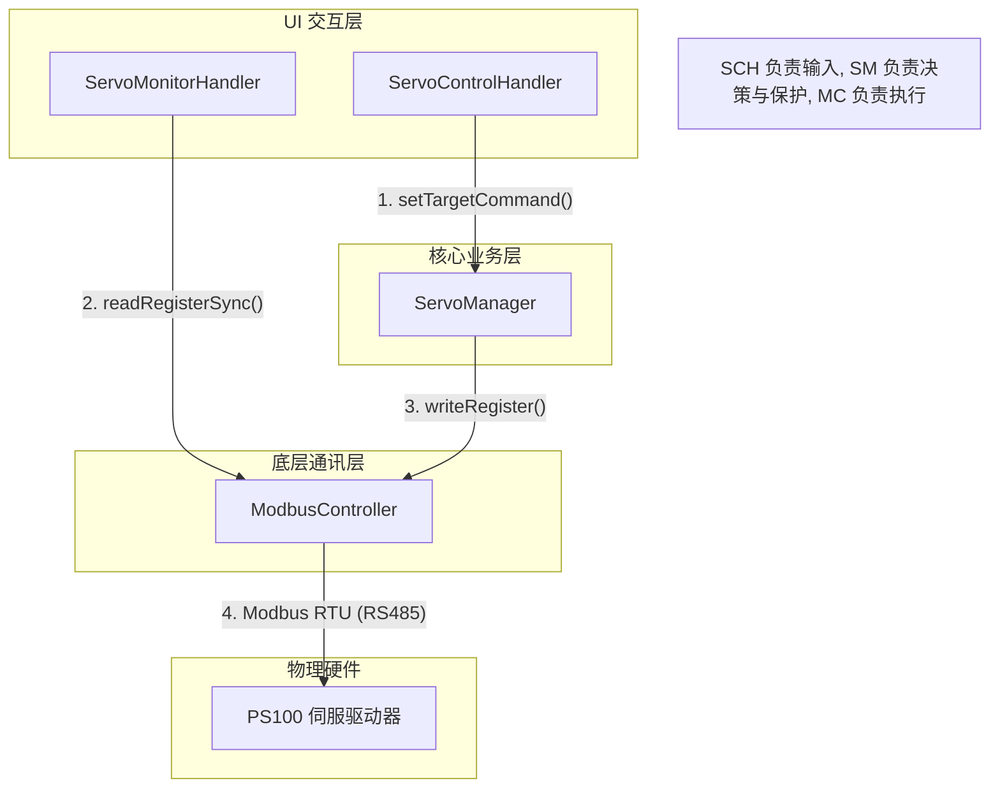

# 伺服系统设计与架构指南 (Architecture Guide)

本文档旨在说明 ESP32 Sorter 项目中伺服控制系统的设计思路、类关系及其采用的工业标准模式。

---

## 1. 核心设计模式 (Design Patterns)

系统架构遵循 “高内聚、低耦合” 的原则，采用了以下三种核心设计模式：

### 1.1 单例模式 (Singleton)
- **ModbusController**: 全局唯一的串口通讯入口。负责 CRC 校验、寄存器读写时序及 RS485 收发方向控制。
- **ServoManager**: 全局唯一的伺服逻辑管理者。持有核心状态机，确保在任何时刻只有一个业务逻辑在与驱动器交互。

### 1.2 处理器模式 (Handler Pattern)
- **BaseDiagnosticHandler**: 定义了 UI 任务的生命周期 (`begin`, `update`, `end`)。
- **ServoControlHandler**: 具体实现类。负责监听旋转编码器输入，并将用户意图（如“设定扭矩为 10%”）转发给 `ServoManager`。
- **RS485DiagnosticHandler**: 专门用于底层链速与物理连通性测试。

### 1.3 有限状态机 (FSM)
- **ServoState (SYS_STATE)**: 工业级的 9 状态流转。涵盖了从上电初始化、报警重置、限速设定到正常运行的全过程。

---

## 2. 软件堆栈与交互图 (Stack & Interaction)

系统的调用关系遵循“分层隔离”原则：

### 交互职责说明：
1. **输入层 (SCH)**: 仅负责 UI 渲染和用户偏移量计算。它不直接向驱动器发指令，而是通过 `sm.setTargetCommand()` 宣告“意图”。
2. **决策层 (SM)**: 根据当前的 FSM 状态，判断是否允许执行该意图。例如：若处于 `SYS_INIT` 态，即便用户旋转了旋钮，指令也会被丢弃直到进入 `SYS_RUNNING`。同时，它会在运行态之前强制写入“安全限速值”。
3. **执行层 (MC)**: 封装了 Modbus 协议细节。它不关心业务逻辑，只负责将 `(RegAddr, Value)` 精确、可靠地送达硬件。

---

## 3. 标准 9 状态机流转 (V3.0)

这是伺服系统的 “灵魂”，它确保了工业场景下的鲁棒性：

| 状态阶段 | 目的 | 逻辑判定 |
| :--- | :--- | :--- |
| **SYS_INIT** | 链路自愈 | 通讯成功 (`Status != 0xFFFF`) 则进入下一级 |
| **SYS_CHECK_ALARM** | 健康巡检 | 读取并解析报警码，确认系统无硬故障 |
| **SYS_RESET_ALARM** | 错误复位 | 尝试软件层面清除警告，若失败则进入 FAULT 态 |
| **SYS_SERVO_ENABLE** | 安全开启 | 只有通讯与状态均正常才允许下发音频/动力使能 |
| **SYS_SET_PARAM** | **核心防飞车** | 必须在出力前强制写入限速寄存器 (`PA31`) |
| **SYS_RUNNING** | 闭环运行 | 监控指令变化，按 Delta > 阈值进行变动下发 |

---

## 4. 关键文件索引

- **[servo_manager.h](file:///d:/Software/antigravity/esp32_sorter/src/servo_manager.h)**: 定义了状态枚举与核心调度接口。
- **[servo_control_handler.h](file:///d:/Software/antigravity/esp32_sorter/src/servo_control_handler.h)**: 定义了不同控制类型（Knob/Pot/Torque）的 UI 逻辑。
- **[modbus_controller.cpp](file:///d:/Software/antigravity/esp32_sorter/src/modbus_controller.cpp)**: 实现了 CRC16 与同步/异步读写时序。

---
*此文档致力于协助开发者快速理解伺服控制的设计哲学。如有修改，请同步更新 `Software_Architecture.md`。*
