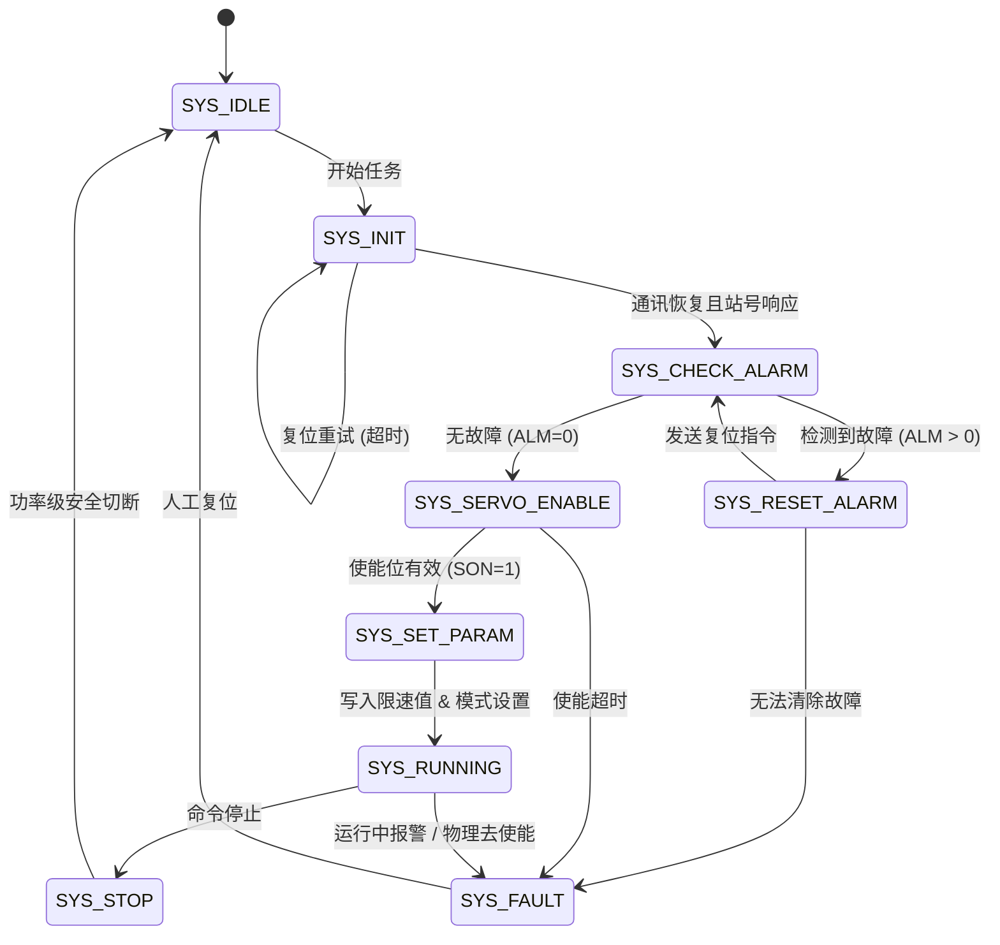

# 伺服工业标准状态机设计方案 (V3.0)

## 1. 核心设计思路
采用工业成熟、普适性强的单层有限状态机 (FSM) 架构，专门针对 **Modbus RTU** 控制模式优化。
- **防止飞车**: 强制在出力（扭矩/速度）前注入限速参数。
- **确定性流程**: 严格按 Initialization -> Alarm Check -> Enable -> Param Set -> Running 顺序执行。
- **故障隔离**: 任何通讯中断、硬件报警或超时均有明确的出口（Fault/Init）。

## 2. 状态机定义 (SYS_STATE)

### 2.1 状态说明表
| 状态名称 | 功能描述 | 关键操作 (Modbus) |
| :--- | :--- | :--- |
| **SYS_IDLE** | 静态初始或模式等待期 | - |
| **SYS_INIT** | 串口握手与波特率确认 | 轮询 0x2001 (Status) |
| **SYS_CHECK_ALARM** | 驱动器级联健康检查 | 读取 0x1013 (Alarm Code) |
| **SYS_RESET_ALARM** | 软件清除暂存警报信号 | 写入 0x2000 = 2 (Reset) |
| **SYS_SERVO_ENABLE** | 通讯使能触发 (SON) | 写入 0x00B5 = 1 (SON RAM) |
| **SYS_SET_PARAM** | 核心安全参数下发 (**关键**) | 写入 0x001F (PA31 限速) |
| **SYS_RUNNING** | 动态指令更新阶段 | 写入指令：0x0018 / 0x0022 |
| **SYS_STOP** | 指令归零与平滑停机 | 写入 Command = 0 & SON = 0 |
| **SYS_FAULT** | 故障锁定状态 | 停止所有 Modbus 写入 |

## 3. 实现细则 (Industrial Standard)
- **限速优先**: 在扭矩模式下，必须首先在 `SYS_SET_PARAM` 状态写入 `PA31` 或是对应的最大转动速度限制，防止空载飞车。
- **通讯保活**: `updateMonitor()` 至少每 100ms 运行一次，若检测到通讯丢失 (`0xFFFF`)，状态机必须立刻退回 `SYS_INIT`。
- **故障可见性**: 报警代码 `alarmCode` 应实时传送到 HMI，故障态 `SYS_FAULT` 不可由于自动重连而消失，必须由人工或上层逻辑显式复位。

---
**当前状态**: 已将 V3.0 工业标准版本成功集成至 `ServoManager` 类。代码结构更稳健，符合所有国产主流伺服（普菲德、韦德等）的通用处理规范。
