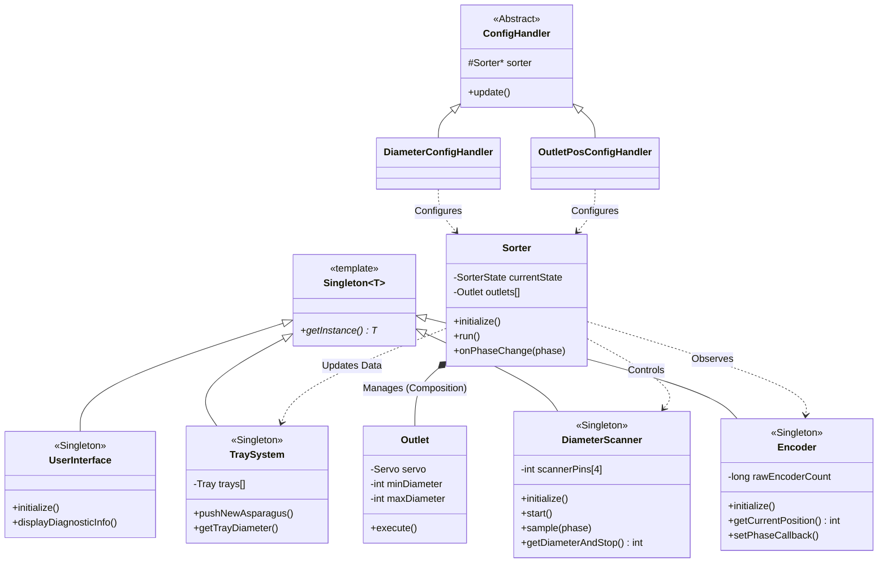
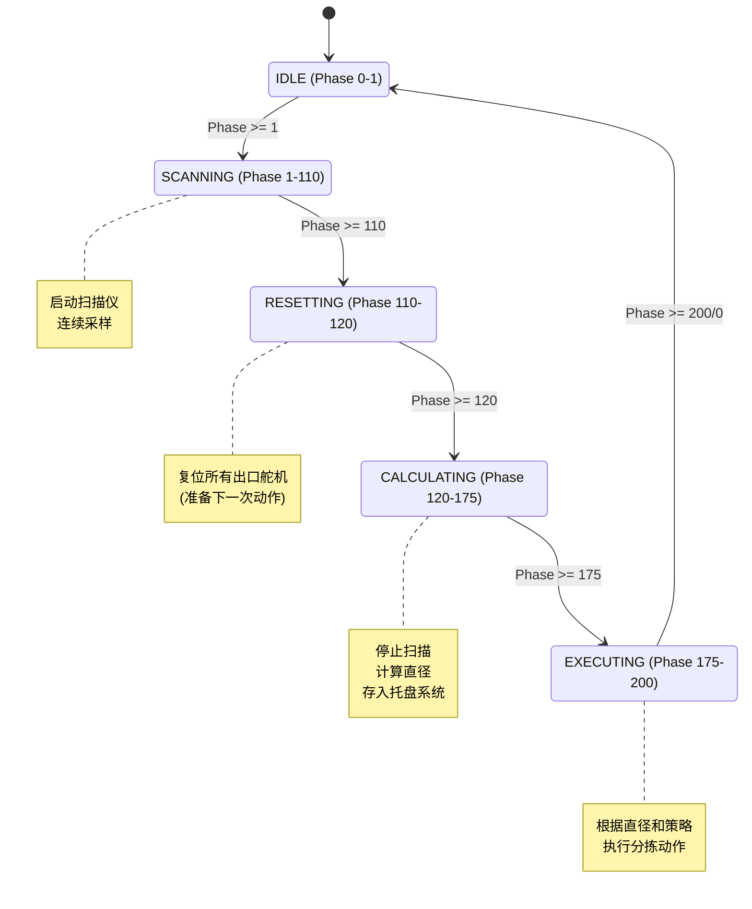
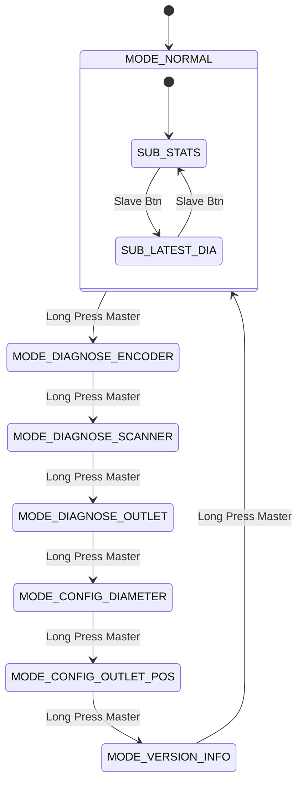
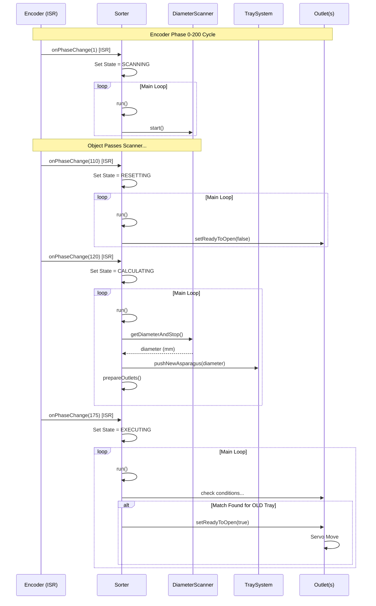

# ESP32 Sorter 系统架构文档 (System Architecture)

本文档描述了 ESP32 芦笋分拣系统的软件架构。代码经过重构，采用了**单例模式 (Singleton Only)**、**状态机 (FSM)** 和**配置中心化 (Centralized Config)** 等设计模式。

## 1. 类关系图 (Class Diagram)

系统核心由 `Sorter` 控制器协调，它通过单例访问各个硬件子系统。

## 2. 状态机图 (State Diagrams)

### 2.1 业务逻辑周期状态机 (Sorter Cycle FSM)
`Sorter` 内部维护一个基于**编码器相位 (Phase)** 的循环状态机，确保分拣流程的确定性。
- **周期**: 0 - 200 脉冲 (对应一个托盘间距)

### 2.2 系统模式状态机 (System Mode FSM)
主程序 (`main.cpp`) 通过长按主按钮切换系统工作模式。

## 3. 业务流程时序图 (Sequence Diagram)

展示一个托盘通过系统时的处理流程（流水线视角）。

